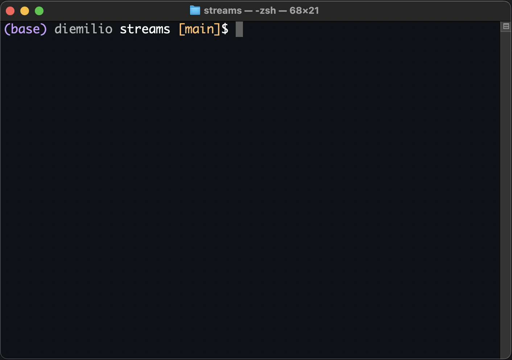

## Display conda environment and git branch in zsh terminal prompt

<p align="center">

</p>

### 1. Disable automatic modification of the command prompt (PS1) by conda
With conda already installed, run the following command in the termial:
```sh
conda config --set changeps1 false
```

or add simply add `changeps1 false` to the `~\.condarc` file. This will disable the automatic modification of the prompt by conda.


### 2. Modify prompt to display conda env and branch
Next, open `~\.zshrc`, and add the following code at the bottom of the file:

```sh
# Determines prompt modifier if and when a conda environment is active
precmd_conda_info() {
  if [[ -n $CONDA_PREFIX ]]; then
      if [[ $(basename $CONDA_PREFIX) == "anaconda3" ]]; then
        # Without this, it would display conda version. Change to miniconda3 if necessary
        CONDA_ENV="(base) "
      else
        # For all environments that aren't (base)
        CONDA_ENV="($(basename $CONDA_PREFIX)) "
      fi
  # When no conda environment is active, don't show anything
  else
    CONDA_ENV=""
  fi
}

# Display git branch
function parse_git_branch() {
    git branch 2> /dev/null | sed -n -e 's/^\* \(.*\)/[\1]/p'
}

# Run the previously defined function before each prompt
precmd_functions+=(precmd_conda_info)

# Define colors
COLOR_CON=$'%F{141}'
COLOR_DEF=$'%f'
COLOR_USR=$'%F{247}'
COLOR_DIR=$'%f'
COLOR_GIT=$'%F{215}'

# Allow substitutions and expansions in the prompt
setopt prompt_subst

PROMPT='${COLOR_CON}$CONDA_ENV${COLOR_USR}%n ${COLOR_DIR}%1~ ${COLOR_GIT}$(parse_git_branch)${COLOR_DEF}$ '
```

### 3. Apply changes
In the terminal, run `source ~/.zshrc`

### 4. References
Original code to modify conda env prompt display settings: 
[how to modify the anaconda environment prompt in zsh?](https://unix.stackexchange.com/questions/656045/how-to-modify-the-anaconda-environment-prompt-in-zsh)

Original code to display git branch: 
[Add Git Branch Name to Terminal Prompt](https://gist.github.com/reinvanoyen/05bcfe95ca9cb5041a4eafd29309ff29)

Helpful video on how to customize the prompt: 
[How to Customize Zsh Command Prompt Text](https://youtu.be/p4h-5B8k2NY)

Interactive tool to select prompt colors: 
[ANSI Color Palette Example](https://kui.github.io/ansi_color_palette/)